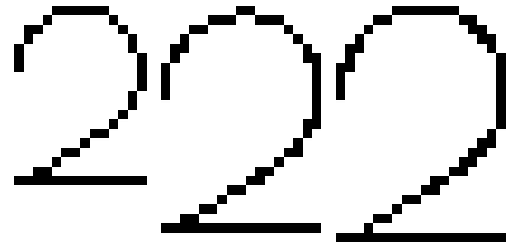
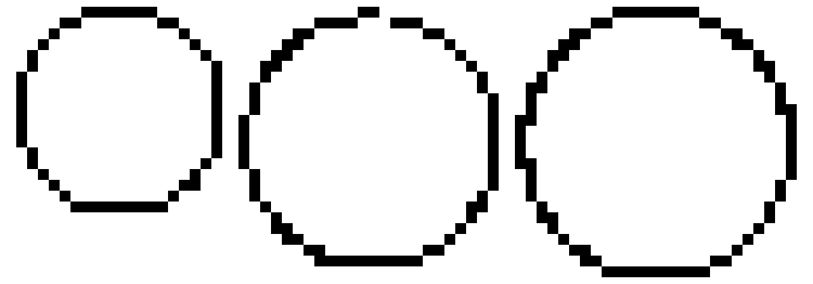
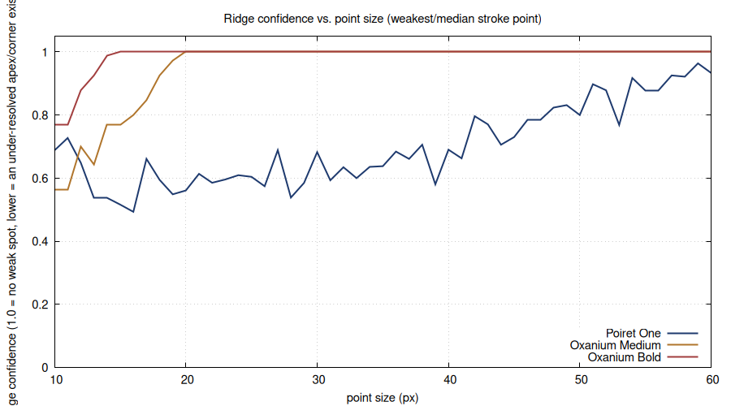
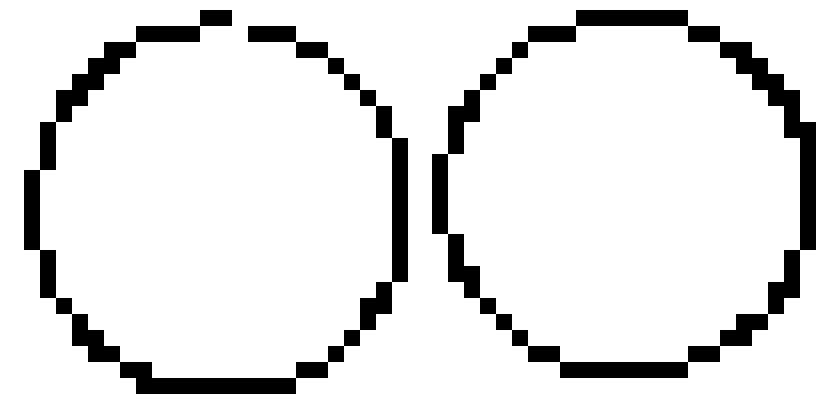
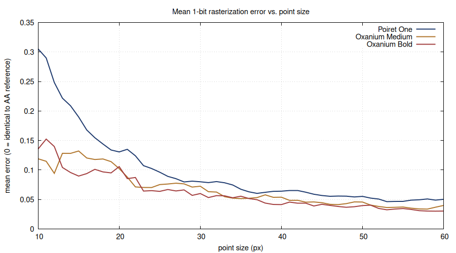
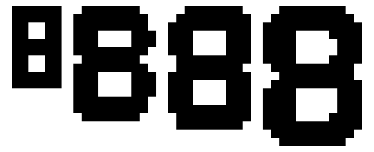

#+TITLE: 1-Bit Glyph Error, by Point Size
#+AUTHOR: Mark W. Johnson
#+DATE: 2026-08-05
#+OPTIONS: toc:2 num:t ^:nil
#+EXCLUDE_TAGS: NOEXPORT
#+LATEX_CLASS_OPTIONS: [11pt,titlepage]
#+LATEX_COMPILER: lualatex
#+LATEX_HEADER: \usepackage{fontspec}
#+LATEX_HEADER: \directlua{luaotfload.add_fallback("symbolfallback",{"DejaVu Sans:mode=node;","Noto Color Emoji:mode=harf;"})}
#+LATEX_HEADER: \setmainfont{Latin Modern Roman}[RawFeature={fallback=symbolfallback}]
#+LATEX_HEADER: \usepackage{xcolor}
#+LATEX_HEADER: \usepackage{changepage}
#+LATEX_HEADER: \usepackage{etoolbox}
#+LATEX_HEADER: \BeforeBeginEnvironment{tabular}{\begin{adjustwidth}{-1.0in}{-1.0in}\centering}
#+LATEX_HEADER: \AfterEndEnvironment{tabular}{\end{adjustwidth}}
#+LATEX_HEADER: \hypersetup{colorlinks=true, linkcolor=blue!60!black, urlcolor=blue!60!black, citecolor=blue!60!black}
#+STARTUP: nofold inlineimages hideblocks
#+PROPERTY: header-args:gnuplot :session none
# :session none is required: without it, org-babel shares a single gnuplot process
# across all org buffers open in the same Emacs session. State set by other files
# (axis labels, formats, ranges, y2 settings) bleeds into blocks here, producing
# corrupt output even when the block starts with "reset". :session none forces a
# clean shell-command-to-string invocation for each block — identical to running
# gnuplot from the terminal — with no inherited state.

* Overview

Pebble bakes every font resource to a hard black/white bitmap at build time
-- there is no anti-aliased glyph path on any platform, gabbro included
(confirmed directly from the SDK's own
~resource_generator_font.py~/~fontgen.py~: the default SDK 2.8+ renderer
loads every glyph with ~FT_LOAD_MONOCHROME | FT_LOAD_TARGET_MONO~). This
document measures how far that 1-bit render strays from an ideal
anti-aliased reference, character by character, across point sizes 10-60,
for the typefaces Moderne uses -- to find which sizes (and, where
possible, weights) hold up better than others at the same visual scale.

Revision note: this document has gone through three passes. It started as
a 32-character survey (just the digits and month-abbreviation letters
Moderne's date/time actually draw) scored on a single mean-error metric.
Applying its first recommendation surfaced a real defect a single averaged
number couldn't see -- see [[*The Apex-Weakness Problem][The Apex-Weakness Problem]] -- so the charset was expanded to the full alphabet and a second metric (ridge
confidence) was added specifically to catch it. That, in turn, pointed at
the actual root cause -- Poiret One ships with no embedded pixel-grid
hinting at all -- which [[*Hinting the Font Definition][Hinting the Font Definition]] addresses directly by hinting the font file itself rather than
just picking around the problem with size choices. Everything below
reflects that third pass; the sizes actually shipped in ~Moderne~ are in
[[*Applied Changes][Applied Changes]].

Source data and the generating script live one directory up, in
~moderne/font_sim.py~ and ~moderne/font_sim_results.json~; this document
is a human-readable report over that data, not the analysis itself.

- *Fonts* Poiret One (Regular) · Oxanium Medium · Oxanium Bold
- *Charset* Full ~A-Za-z0-9~ (62 characters) -- a superset of what
  ~draw_digital_time~/~draw_date_and_time_display~ actually draw via
  ~"%H:%M"~ and ~"%d %b %Y"~, chosen for general-purpose size/weight
  selection rather than just those two strings.
- *Renderer* FreeType, SDK 2.8 default flags (Moderne stays on 2.8; see
  the ~compatibility: "2.7"~ writeup elsewhere in the project for why that
  legacy path isn't simulated here).

* Method

Two metrics, both computed per (font, size, character):

- *Mean error* -- render the glyph twice at the same pixel size: once with
  Pebble's exact mono-hinted flags, once with FreeType's own default
  anti-aliased render as a same-size "ideal" reference. Error is the mean
  absolute difference between the two, aligned on shared glyph bearings.
  0 = the 1-bit bitmap looks identical to the smooth reference; higher =
  more visible distortion overall. Good *whole-glyph roughness* signal,
  but being an average, a 2-3px weak patch on an otherwise-clean 30x30px
  glyph barely moves it -- exactly the blind spot that motivated the
  second metric.
- *Ridge confidence* -- find local coverage maxima in the AA reference
  (the ridge running along a stroke's own centerline; orientation-
  independent, unlike a row/column run-length scan, which misses
  diagonal-stroke thinning). Take (weakest ridge point) / (median ridge
  point). Close to 1.0 = the stroke is confidently resolved everywhere;
  well under means some specific spot -- usually a shallow curve apex or
  tight corner -- is landing in-between pixels at that size, for that
  glyph, regardless of mono vs AA.

Both are proxies, not a full perceptual model -- see [[*Caveats][Caveats]].

* The Apex-Weakness Problem

The first version of this survey (mean error only, narrower charset)
recommended moving gabbro's Weather/Date Poiret One size from 25 to 31.
Applied and installed, the "0" was reported to look like it had a missing
pixel.

Investigating found it was *not* a mono-rendering dropout: connectivity
analysis (8-connected components) showed no actual break, on either the
simulated glyph or the real on-device screenshot. What it actually is: the
anti-aliased *reference* itself only reaches ~56% coverage at that curve's
apex at size 31 (values 4-144 out of 255, smeared across 8 pixels instead
of concentrated in 1-2) -- a genuine sub-pixel resolution limit for *any*
rasterizer at that exact size, not something unique to Pebble's 1-bit
pipeline. Mono then has to draw a hard line through genuinely ambiguous
territory, and the result reads as a thin, asymmetric peak. Figure
[[fig:apex-defect]] shows it directly: size 31's "0" and "2" both have a
visibly weaker top compared to the original size 25 and the revised size
33.

#+CAPTION: Poiret One "2" (top) and "0" (bottom) at 25 (original), 31 (the defect), 33 (the fix). 16x nearest-neighbor scaled.
#+NAME: fig:apex-defect

Ridge confidence (see [[*Method][Method]]) is built to catch exactly this. Figure
[[fig:ridge-by-size]] plots it alongside the mean-error chart -- and shows
something the single-metric version of this document couldn't: Oxanium
(both weights) reaches a *perfect* 1.0 by roughly size 15-20 and stays
there for the rest of the range. Poiret One *never* reaches 1.0, even at
size 60. That's not a "pick a better size" problem -- Poiret One's thin,
curvy, art-deco letterforms are inherently more prone to this class of
artifact than Oxanium's blockier ones, at essentially any practical point
size. Picking a good size reduces the risk; it doesn't eliminate it.

#+begin_src gnuplot :file ridge_confidence_by_size.png :dir .
reset
set terminal pngcairo size 900,500 font "Helvetica,11"
set title "Ridge confidence vs. point size (weakest/median stroke point)"
set xlabel "point size (px)"
set ylabel "ridge confidence (1.0 = no weak spot, lower = an under-resolved apex/corner exists)"
set key bottom right
set grid
set xrange [10:60]
set yrange [0:1.05]
set style line 1 lc rgb '#1E3A6E' lw 2
set style line 2 lc rgb '#B0752C' lw 2
set style line 3 lc rgb '#A23E3E' lw 2
plot 'ridge_confidence_by_size.dat' using 1:2 with lines ls 1 title "Poiret One", \
     '' using 1:3 with lines ls 2 title "Oxanium Medium", \
     '' using 1:4 with lines ls 3 title "Oxanium Bold"
#+end_src

#+CAPTION: Ridge confidence (weakest-point/median-point stroke ratio) vs. point size. Oxanium saturates at 1.0 early; Poiret One never does. Data in ridge_confidence_by_size.dat.
#+NAME: fig:ridge-by-size
#+RESULTS:

* Hinting the Font Definition

Historically, fonts meant for a specific low-resolution display were tuned
to that pixel grid directly -- bitmap fonts, or hand-hinted outline fonts
with explicit per-size grid-fitting instructions baked in. Most modern
webfonts skip that: they ship outlines only and lean on the renderer's
generic autohinter, which has no idea what device or size it'll actually
land on. Checked directly against Poiret One's own font tables: it ships
with *zero* embedded hinting -- no ~fpgm~ program at all, and the "zero"
glyph carries 0 instruction bytes. That's the actual mechanism behind the
apex-weakness problem above: nothing in the font file expresses any intent
about how its curves should land on a pixel grid at any particular size.

~ttfautohint~ is the standard tool for exactly this gap: it analyzes the
existing outlines and generates real TrueType hint instructions -- per-
glyph stem/curve grid-fitting rules -- without moving a single outline
point. Same master shapes, same aesthetic; just explicit instructions for
how the rasterizer should snap them to a pixel grid.

#+begin_src shell :results silent :exports code
ttfautohint --hinting-range-min=8 --hinting-range-max=60 \
  PoiretOne-Regular-original.ttf PoiretOne-Regular.ttf
#+end_src

Run against the full 51-size x 62-char sweep, hinted vs. original, both
through Pebble's exact ~FT_LOAD_MONOCHROME | FT_LOAD_TARGET_MONO~ path:
ridge confidence improves at 38 of 51 sizes (worse at only 6), and the
size-range average moves from 0.640 to 0.699. Mean error improves at 37 of
51 sizes. Figure [[fig:hinting-before-after]] shows the concrete case: the
same "0" at size 31 that started this whole investigation, un-hinted (left)
against hinted (right) -- the top of the ring goes from a thin, isolated
peak to a solid, continuous arc.

#+CAPTION: Poiret One "0" at size 31 -- original (left) vs. ttfautohint-hinted (right). Same outline, same file, only the embedded hint instructions differ.
#+NAME: fig:hinting-before-after

This measurably helps at most of Moderne's shipped sizes without hurting
any of them, so it's applied: ~resources/fonts/PoiretOne-Regular.ttf~ *is*
the hinted file as of this revision (same filename/path, so no
~package.json~ or ~scalable.c~ changes were needed -- only the bytes
changed). The original, unhinted TTF isn't kept in the repo separately;
git history has it if a comparison is ever needed again. Everything from
here on (charts, the applied-sizes table) is measured against the hinted
font. [[*The Apex-Weakness Problem][The Apex-Weakness Problem]] above, and
its figure, are the one exception -- that investigation and its images
predate hinting and describe the original file.

One loose end worth naming rather than silently leaving: the six sizes in
[[*Applied Changes][Applied Changes]] were chosen *before* hinting existed,
against the unhinted font. Hinting can shift which size is locally best,
and it did for one slot -- Time (g)'s original size (59) now measures
*better* than the chosen replacement (56) under the hinted font (ridge
confidence 0.964 vs. 0.878). Re-running the full size search against the
now-hinted font would likely move other slots too; that's a reasonable
next iteration if it's worth another round, not done here.

Further options beyond this, if the remaining gap still matters: hand-
tuning hints for the specific sizes ~ttfautohint~ didn't help (VTT-style
manual editing, more specialist effort), or bypassing Pebble's native font
pipeline entirely in favor of pre-rendered dithered glyph bitmaps -- full
manual control over every pixel, consistent with this repo's existing
dithering philosophy (see the top-level ~README.md~/~DESIGN.md~), but a
much larger engineering lift than either sizing or hinting.

* Error vs. Point Size

Sizes 10 to 60, charset-averaged (full 62-character set), for all three
fonts, measured against the hinted Poiret One. See Figure
[[fig:error-by-size]].

#+begin_src gnuplot :file error_by_size.png :dir .
reset
set terminal pngcairo size 900,500 font "Helvetica,11"
set title "Mean 1-bit rasterization error vs. point size"
set xlabel "point size (px)"
set ylabel "mean error (0 = identical to AA reference)"
set key top right
set grid
set xrange [10:60]
set yrange [0:*]
set style line 1 lc rgb '#1E3A6E' lw 2
set style line 2 lc rgb '#B0752C' lw 2
set style line 3 lc rgb '#A23E3E' lw 2
plot 'error_by_size.dat' using 1:2 with lines ls 1 title "Poiret One", \
     '' using 1:3 with lines ls 2 title "Oxanium Medium", \
     '' using 1:4 with lines ls 3 title "Oxanium Bold"
#+end_src

#+CAPTION: Mean rasterization error vs. point size -- lower is better. Data in error_by_size.dat, columns are size / Poiret One / Oxanium Medium / Oxanium Bold.
#+NAME: fig:error-by-size
#+RESULTS:

Bigger is smoother, as expected -- more pixels resolve curves better --
but Oxanium Bold shows a sharp local spike at 20-22px (nearly as bad as
size 14 despite being 40% larger), and all three fonts show a smaller
local bump around size 30. Neither shows up if you only look at "does
error trend downward."

* Applied Changes

Three passes landed here, in order: (1) an initial size pass against the
unhinted font, (2) hinting the font file itself (previous section), which
shifted the landscape enough that one slot's choice (Time (g)) was no
longer locally best, and (3) a full re-optimization of all six slots
against the now-hinted font, using the same rule as pass 1 -- *only move a
size if the candidate does not regress ridge confidence*, among candidates
within +/-6px that also improve mean error -- but this time starting from
the pass-1 sizes and re-searching with the hinted data. The table below is
the result of pass 3; it supersedes the two before it. (Pass 1 and pass 2's
intermediate numbers are in git history if that trail matters later.)

#+CAPTION: Poiret One sizes actually applied in package.json/scalable.c -- final, post-hinting, post-re-optimization
#+NAME: tab:applied
| Slot                | Was (pass 1) | Now (pass 3) | Mean error        | Ridge confidence  |
|---------------------+--------------+--------------+--------------------+-------------------|
| Weather/Date (o)    |           20 |           31 | 0.1307 -> 0.0786  | 0.561 -> 0.593    |
| Weather/Date (c/e)  |           24 |           30 | 0.1025 -> 0.0800  | 0.609 -> 0.682    |
| Weather/Date (g)    |           31 |           34 | 0.0786 -> 0.0746  | 0.593 -> 0.636    |
| Time (o)            |           36 |           38 | 0.0630 -> 0.0622  | 0.684 -> 0.706    |
| Time (c/e)          |           44 |           54 | 0.0589 -> 0.0468  | 0.706 -> 0.917    |
| Time (g)            |           59 |           54 | 0.0490 -> 0.0468  | 0.964 -> 0.917    |

Time (c/e) and Time (g) both landing on 54 is coincidence -- two
independent optimizations, not a shared value -- and they remain two
distinct resources (~POIRET_ONE_54~ vs ~POIRET_ONE_54_G~) because only the
"g" one needs the gabbro-only ~targetPlatforms~ scoping (see [[*Hinting the Font Definition][Hinting the Font Definition]]'s note on the 256-byte-per-glyph limit).

Weather/Date (g) is the size that had the originally-reported defect, and
is the one slot where the metrics-only answer isn't the applied one: pass
3's raw search recommended 37 (mean error 0.0604, ridge confidence 0.661
-- better on both axes than 34). It was *not* used, for the same reason a
different candidate size (37, coincidentally) was already rejected once
before pass 2 existed: at 37px, "05 Aug 2026" measures 259px wide against
a display that's only reliably usable to roughly that width at the date's
row, and "15 May 2026" (the actual widest month abbreviation, checked
across all twelve) comes out to exactly 259px too. 34px measures 236px for
the same worst-case string -- confirmed on-device, no clipping, for both
the current date and 15 May 2026. *Neither metric in this survey knows
anything about layout* -- they only score glyph shape fidelity in
isolation. A size change always needs an on-device check for the actual
strings involved, not just the numbers here; this is the second time that
check caught something the numbers alone would have missed.

Time strings ("HH:MM") are short enough that none of the Time candidates
tested came close to a width concern (167px at the largest, size 59,
against a much wider usable band at the display's vertical center) -- the
width constraint only bites the date, not the clock.

Weather/Date (o) and Weather/Date (c/e) went through the same kind of
jump as gabbro's date size (20->31, 24->30) without the same width check:
the 259px-vs-230px math above is specific to gabbro's 260px round display
and the date row's particular vertical offset -- aplite/basalt/chalk/emery
have different dimensions (and aplite/basalt/diorite/flint aren't even
round), so gabbro's safe number doesn't transfer. This hasn't been
computed or screenshotted for those platforms at all; it's the largest
open risk left in this document.

** Post-pass-3 revision: Weather/Date (g) moved again, to 27

After pass 3 shipped 34px, a closer look at the full ±6px window (25-37,
centered on the pass-1 size of 31) turned up 27px: worse mean error than
34 (0.0853 vs 0.0746) but a noticeably better ridge-confidence-min (0.689
vs 0.636) -- the best in the whole window, including 34. Since
ridge-confidence-min is specifically the metric built to catch apex
weakness (the defect this whole survey started from), and pass 3's own
rule already treats ridge confidence as the thing not to regress, 34px's
own selection under-weighted it relative to mean error. 27 was applied in
its place.

Width was re-checked exhaustively (all 31 days x 12 months, not just the
single worst-case string used for 34px): 27px's worst case is "05 May
2026" at 187px, comfortably inside the 260px display and well under 34's
own 236px worst case. ~TIME_SEP_MARGIN~ (config.h) was also re-measured
for 27px's own widest glyph ('W', 28px advance, down from 35px at 34)
and shrunk to match.

This was not re-run through pass 3's automated candidate search --
that search's "improves mean error" gate is exactly what excluded 27 the
first time, despite its ridge-confidence lead. Whether the same gate is
quietly excluding a better candidate at any of the other five slots has
not been checked; this is now the second largest open risk in this
document, after the un-verified (o)/(c/e) widths noted above.

** Bitmap-glyph rendering sidesteps the size-tradeoff problem entirely

Everything above is about picking the *least-bad* native 1-bit rendering
size -- every candidate still goes through hard monochrome rasterization,
so every choice is a tradeoff (see the apex-weakness discussion). gabbro
also has a second, independent rendering path now (~glyph_atlas.py~ /
~glyph_atlas.c~, ~CONFIG_FONT == POIRET_BITMAP~) that pre-renders each
glyph from the TTF with real anti-aliasing and ships it as a 2-bit-alpha
bitmap, blitted with ~GCompOpSet~ instead of going through the SDK's font
rasterizer at all. It was built for Time first (54px, matching
~POIRET_ONE_54_G~) and extended to Date (27px, matching the revised
Weather/Date size above) once the 27px native rendering was confirmed to
look good enough to be worth reproducing losslessly.

The resource cost is small: Date's charset is larger than Time's (33
glyphs -- digits, space, and every letter in an abbreviated month name --
versus Time's 11) but each glyph is a quarter the pixel area at 27px vs
54px, so the two atlases (white-fg + black-fg, 445x21px) added only
~1.6KB to the gabbro resource pack (31327 -> 32947 bytes, against a
256KB budget). Most of the runtime module needed no Date-specific code:
the baseline-alignment logic already worked off each string's own tallest
glyph, so mixed ascender/descender letters (e.g. "p", "g", "y" hanging
below the baseline) needed no special-casing.

** The bitmap atlas is not a universal win -- Date looks worse bitmapped

Once both Time (54px) and Date (27px) had bitmap-glyph atlases, a direct
on-device comparison found Date's *native* 27px rendering actually looks
better than its bitmap version, the opposite of Time's result. The likely
cause: Poiret One's stroke width at 27px is sub-1px, so a real
anti-aliased render of that stroke is mostly partial coverage with no
pixel near full black/white. The atlas pipeline snaps that coverage to
the SDK's 4 alpha levels (0/33/66/100%, same as
~gcolor_blend~/~save_alpha_layer~), which is enough resolution for a
stroke that's several pixels wide (Time, at 54px) but turns a sub-pixel
stroke into a visibly patchy, inconsistent line instead of the clean
single-pixel line hard 1-bit rounding naturally produces. In other words:
the same monochrome "hard rounding" that causes apex weakness on curves
is, for a near-1px straight stroke, closer to what the eye expects than
4-level alpha is.

This is why ~CONFIG_FONT~ has a fourth value, ~POIRET_HYBRID~
(~FONT_POIRET_HYBRID~ in config.h) -- bitmap glyphs for Time, native TTF
for Weather/Date -- made the *default*, ahead of plain ~POIRET_ONE~
(all-native) and ~POIRET_BITMAP~ (all-bitmap). The general lesson: the
bitmap atlas is a strict improvement over native rendering only when the
glyph's stroke width at the target size is comfortably more than 1px
(true here at 54px, not at 27px); below that, real anti-aliasing has
less to work with than 1-bit rounding does, and this should be checked
per size before assuming bitmapping something is automatically an
improvement -- it was not tested whether the Weather panel's own text
(also 27px, only shown under ~FULL_DIAL~) would follow the same rule as
Date, though there is no reason to expect otherwise since it is the same
font/size on the same display.

** Fixing splotchiness by dilating coverage before downsampling

The 27px "gray splotches" have a direct numeric explanation: the alpha
snap (~((a*255+42)//85)*85~) needs a downsampled pixel's coverage to be
>=83.5% to land on 100% (opaque white); below that it snaps to 66% or
33%, which reads as gray. A histogram of the shipped (pre-fix) Date atlas
confirmed it -- only 9.4% of ink pixels reached 100% alpha, versus 47.3%
for Time's 54px atlas, where the several-pixel-wide stroke has room to
carry real full-coverage pixels.

The fix: dilate the coverage bitmap (grey_dilation, at the 4x supersample
stage, *before* the linear-light downsample) so more of each stroke's
width survives into the final pixel grid at high coverage. A sweep of
dilation radius r (in supersampled px; target-pixel growth is roughly
r/4 per side), measured across Date's full charset:

#+CAPTION: Dilation radius vs. opacity, ink growth, and counter survival (o/e/a/g/... enclosed loops)
| r (ss px) | 100%-alpha ink | Ink-pixel growth | Counters open |
|-----------+----------------+-------------------+----------------|
|         0 |           9.4% |              1.00x |          12/12 |
|         1 |          49.5% |              1.32x |          12/12 |
|         2 |          59.2% |              1.60x |          12/12 |
|         3 |          68.1% |              1.84x |          12/12 |
|         4 |          76.2% |              2.06x |          12/12 |
|         6 |          82.2% |              2.51x |          12/12 |

The counter-survival check (connected-component labeling of the fully-
transparent region, flagging characters whose enclosed hole -- 'o', 'e',
'a', 'g', 'b', digits with loops -- gets fully swallowed by dilation)
never actually triggered in this range; a side-by-side rendered
comparison was the metric that actually caught the failure mode instead
-- by r=6, 'g'/'9'/'8' are visibly closing in on blobby even though no
hole was ever *fully* closed. r=1 was chosen: it captures most of the
opacity gain (9.4% -> 49.5%) for the least distortion (1.32x), with no
visible change to the letterform's character in the side-by-side
comparison. Applied to Date only (~glyph_atlas.py~'s ~ATLASES~ list,
~"dilate": 1~) -- Time's atlas is untouched (~"dilate": 0~, a no-op) since
its 54px stroke width never had this problem in the first place.

** Bitmap text sat higher than native text at the same size

Separately from opacity, bitmap-glyph text was also positioned wrong:
~glyph_atlas_draw_string()~ anchors its baseline to the tallest glyph's
own ink (~bearing_y~ from FreeType), with zero padding above it, but
native ~graphics_draw_text()~ reserves extra headroom above the glyphs
based on the font's full ascent. Measured by pixel-diffing a native vs.
bitmap screenshot of the same string/background: bitmap text sat *12px
higher* than native at 54px (Time) and *6px higher* at 27px (Date) --
horizontal centering, by contrast, already matched within ~1px in both
cases, so this was purely a vertical problem.

Both offsets happen to equal exactly half the font's own descender
magnitude at that size (FreeType reports Poiret One's descender as -12px
at pixel size 54; half of that is 6, matching Date's 27px offset exactly
by linear scaling) -- plausibly related to how Pebble's internal text
layout reserves line-box space, though the exact algorithm isn't in the
public API, so this was captured as an empirically-measured constant
rather than derived from a formula. ~glyph_atlas.py~'s ~ATLASES~ list now
has a ~"y_offset"~ per atlas (12 for Time, 6 for Date), baked into the
generated metrics header as ~GLYPH_ATLAS_<NAME>_Y_OFFSET~ and added into
~glyph_atlas_draw_string()~'s baseline calculation. Re-measure the same
way (pixel-diff a same-string native/bitmap screenshot pair) if either
atlas's point size changes.

* Oxanium Findings (Unchanged)

Oxanium's own sizes weren't changed -- these are carried over from the
original pass and still hold, since Oxanium's underlying data didn't move:

- *Oxanium Bold, 20-22px* -- the sharpest spike in the whole survey. If
  Oxanium Bold has to sit in the 20px range, use 19 or 23-25, not 20-22.
  See Figure [[fig:oxbold-8]].
- *Size 30, across all three fonts* -- a smaller local bump at exactly
  30px for all three fonts, 8-12% worse than immediate neighbors.

#+CAPTION: Oxanium Bold "8" at 14, 20, 21, 25px. Size 20 visibly bulges on the lower-right relative to its neighbors.
#+NAME: fig:oxbold-8

* Caveats

- Poiret One ships Regular only on Google Fonts -- there's no bold cut to
  compare against Oxanium's Medium/Bold pair, so the "weight" half of the
  original question only has a real answer for Oxanium.
- The charset is equal-weighted per unique character, not
  frequency-weighted by how often each actually appears on screen (digits
  dominate real screen time far more than, say, "v" or "y").
- Both metrics are glyph shape fidelity only -- they say nothing about
  legibility, tracking/kerning, how the two fonts' natural proportions
  compare to each other, or -- as [[*Applied Changes][Applied Changes]] found the hard way --
  whether a string actually fits its on-screen bounds.
- Ridge confidence is a proxy for "is there a locally weak point," tuned
  against one real reported defect. It isn't validated against a broader
  set of known-good/known-bad renders, so treat a low score as "worth a
  visual check," not an automatic verdict.

* Do Not Export :NOEXPORT:
:PROPERTIES:
:VISIBILITY: folded
:END:
This section won't be exported
* COMMENT Emacs Local Variables :NOEXPORT:
:PROPERTIES:
:VISIBILITY: folded
:END:

What each file-local variable below does, and why it is there.

** ~truncate-lines: t~

Don't soft-wrap long lines at the window edge — let them run off to the
right.  With wrapping on, the inline images embedded between paragraphs
re-flow on every window resize and make the source unpleasant to edit;
truncation keeps the structural layout stable.

** ~org-confirm-babel-evaluate: nil~

Run ~C-c C-c~ on a source block without the "Evaluate this code block?"
prompt.  This file is full of trusted babel blocks that are re-run
frequently during authoring; the confirmation prompt becomes pure
friction.

** ~(auto-revert-mode 1)~

Re-read the buffer from disk whenever the underlying file changes.  Useful
when an external tool (or a CI / formatting hook) rewrites the file behind
Emacs's back so the changes show up immediately.

** ~(add-hook 'org-babel-after-execute-hook 'org-redisplay-inline-images nil t)~

After a babel block finishes, refresh the inline image overlays in this
buffer.  Without this hook the image file is rewritten but the overlay
still shows the stale version until you run
~org-redisplay-inline-images~ by hand.  The trailing ~nil t~ makes the
hook buffer-local.

** ~(font-lock-add-keywords nil '(("️" (0 '(face nil display "")))) t)~

Many Unicode symbols exist in two presentations: a text version (single-width,
monospace-compatible) and an emoji version triggered by appending U+FE0F
(variation selector-16).  Emacs counts both forms as width 1, but the emoji
glyph renders visually wider, throwing off org-mode table alignment.

Rather than mapping individual characters, this font-lock rule makes U+FE0F
itself invisible (~display ""~) everywhere it appears.  The base character
remains and renders in its text presentation, fixing alignment for the entire
class: ⚠️ ℹ️ ✔️ ✖️ ☑️ ✉️ ✏️ ✂️ ☎️ ❄️ ♻️ ⚙️ ➡️ ↩️ and any others.  The
underlying file is unchanged.

** The ~post-command-hook~ block (~org-table~ at 85%)

Keep ~org-table~ cells at 85% of the body-text size, and have that ratio
track ~text-scale-increase~ / ~text-scale-decrease~.

Why simpler approaches don't work in this setup:

- A relative remap such as ~(face-remap-add-relative 'org-table :height 0.85)~
  doesn't track text-scale, because with ~variable-pitch-mode~ active the
  ~default~ face is remapped to a variable-pitch font (Inter), but
  ~org-table~ inherits from ~fixed-pitch~ (JetBrains Mono).  Scale changes
  applied to ~default~ never propagate down the ~fixed-pitch~ chain.
- An absolute remap (e.g. ~:height 92~) pins the table at a fixed point
  size, so it stays put when the body text scales.
- Advising ~text-scale-set~ doesn't fire: ~text-scale-increase~ is a C
  subroutine that calls ~text-scale-set~ at the C level, bypassing any
  Elisp advice attached to the symbol.

What the hook does:

1. On each ~post-command-hook~ tick it reads the current text-scale factor
   straight out of ~face-remapping-alist~ (the ~:height~ value Emacs stores
   on the ~default~ entry).
2. If that factor changed since the last command, it recomputes
   ~target = round(0.85 × default-base-height × scale)~ in tenths of a
   point and re-applies the remap to ~org-table~.
3. A one-element state cell (~(list 1.0)~) caches the previous factor so
   the alist is only rewritten when the scale actually changes — keystrokes
   that don't touch text-scale are essentially free.

Buffer-local hooks are released automatically when the buffer is killed,
so no explicit ~kill-buffer-hook~ cleanup is required.

** ~(org-table-map-tables #'org-table-align)~

Walk every table in the buffer at open time and call ~org-table-align~ on
it.  Tables saved with non-default column widths or stale alignment can
look ragged until they're re-aligned; doing it once on visit gives a
clean view.

** ~(add-to-list 'revert-without-query ".*\\.png")~

When a PNG buffer is reverted (because a babel block regenerated the
file), don't prompt — just reload it.  PNGs in this file are derived
artifacts, never hand-edited, so there's never anything to lose.

** ~(setq-local org-export-exclude-tags '("NOEXPORT"))~

Tell the exporter to skip any heading tagged ~:NOEXPORT:~ (including this
section itself).  Without this, the prose explaining the local variables
would leak into the exported HTML / PDF.

# Local Variables:
# truncate-lines: t
# org-confirm-babel-evaluate: nil
# eval: (auto-revert-mode 1)
# eval: (add-hook 'org-babel-after-execute-hook 'org-redisplay-inline-images nil t)
# eval: (font-lock-add-keywords nil '(("️" (0 '(face nil display "")))) t)
# eval: (let* ((state (list 1.0)) (fn (lambda () (let* ((spec (cadr (assq 'default face-remapping-alist))) (cur (or (and (listp spec) (plist-get spec :height)) 1.0))) (unless (equal cur (car state)) (setcar state cur) (setq face-remapping-alist (assq-delete-all 'org-table face-remapping-alist)) (face-remap-add-relative 'org-table :height (round (* 0.85 (face-attribute 'default :height) (if (floatp cur) cur 1.0))))))))) (funcall fn) (add-hook 'post-command-hook fn nil t))
# eval: (org-table-map-tables #'org-table-align)
# eval: (add-to-list 'revert-without-query ".*\\.png")
# End:
